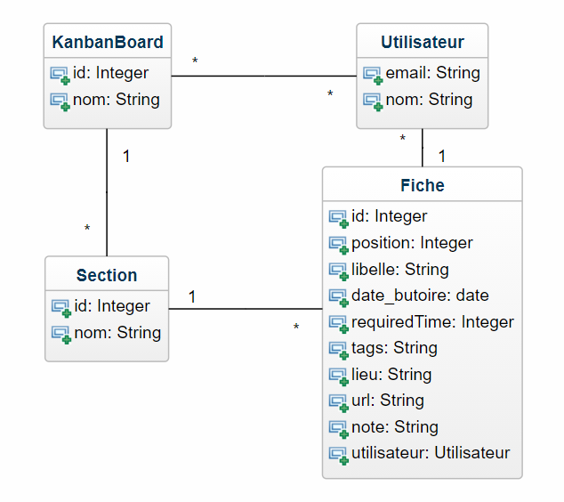

# TP5 Report

## Clone git repository
https://github.com/Jlebours/JaxRSOpenAPI

## How to install
- Install Maven
- Install Java 15 (15.0.2 used)
- Install MySQL 8 

## How to run
Open phpMyAdmin in localhost , create : 
- a database named '**mydatabase**'
- a user with login '**root**' and no password

Run RestServer ~ 
App is running on the 8082 port

To question the web service with Swagger : http://localhost:8082/api/

## About
J'ai principalement travaillé sur la classe utilisateur, vous pourrez ainsi exécuter des get, post, put et delete via le swagger.

Vous pourrez également manipuler les admin qui héritent de l'utilisateur.

J'ai globalement tenté tous les types de requêtes (classique, nommée etc.. )

Je me suis arrêté à la partie utilisateur car pour terminer le tp ensuite, il s'agissait globalement de copy/past de ce que j'avais déjà fait
que ce soit pour la partie dao, les classes (domain) en elles-mêmes et la mise en place du service web. 

## Digramme de classe (en bonus)
- Il manque juste le role de l'utilisateur

  
## Student 
Johan LE BOURSICAUD
  
